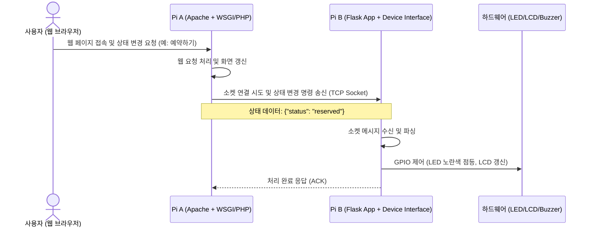

# 라즈베리 파이 2대 기반 예약 및 상태 표시 시스템 구현 계획

본 프로젝트는 두 대의 라즈베리 파이(Pi A, Pi B)를 활용하여 상태('대기', '예약', '사용')에 따라 LED, LCD, 부저 등의 하드웨어를 제어하고 상호 소켓 통신을 수행하는 예약 시스템입니다.

---

## 1. 제품 요구사항 정의서 (PRD)

### 1.1 서비스 개요
- **목적**: 사용자가 웹을 통해 공간이나 장비를 예약 및 사용할 수 있도록 하고, 이를 물리적인 LED, LCD, 부저로 실시간 표시 및 알림을 제공하는 IoT 예약 시스템 구축.
- **주요 사용자**: 웹 브라우저를 통해 예약 현황을 확인하고 예약을 진행하는 사용자.

### 1.2 상태 정의 및 시스템 흐름
시스템은 크게 세 가지 상태를 가집니다.
1. **대기 (Idle / Available)**:
   - LED: 초록색 점등
   - LCD: "Status: Available" 표시
2. **예약 (Reserved)**:
   - LED: 노란색 점등
   - LCD: "Status: Reserved" 표시
3. **사용 (In Use / Occupied)**:
   - LED: 빨간색 점등
   - LCD: "Status: In Use" 표시

#### 상태 전이에 따른 부저 알림:
- **예약 ➔ 사용 (전이 시)**: 부저에서 3가지 상승음(예: 도-미-솔 / C4-E4-G4)을 연주.
- **사용 ➔ 대기 (전이 시)**: 부저에서 다른 3가지 하강음(예: 솔-미-도 / G4-E4-C4)을 연주.

### 1.3 하드웨어 요구사항
- **라즈베리 파이 A**: 클라이언트 웹 인터페이스 서빙 및 소켓 클라이언트 역할 (Apache 탑재).
- **라즈베리 파이 B**: 센서 및 액추에이터 제어 및 소켓 서버 역할 (Flask/Python 탑재).
- **I2C LCD (16x2)**: 상태 텍스트 출력용.
- **RGB LED** (또는 R/Y/G 개별 LED 3개): 대기(초록), 예약(노란), 사용(빨간) 색상 제어용.
- **피에조 부저 (Passive Buzzer)**: 주파수 제어를 통해 음계를 출력하기 위한 부저.

---

## 2. 시스템 아키텍처 및 구조 (Structure)

### 2.1 통신 아키텍처
두 개의 라즈베리 파이 간의 역할 분담 및 실시간 소켓 통신 구조입니다.



### 2.2 디렉토리 구조 (Directory Structure)

```
light_reservation/
├── pi_a_apache/            # Pi A (Apache 웹 서버용 소스 코드)
│   ├── index.html          # 사용자 예약 웹 UI
│   ├── app.js              # 프론트엔드 비동기 요청 처리
│   └── api/                # Apache 백엔드 스크립트 (Python CGI 또는 PHP)
│       └── update_status.py # Flask(Pi B)로 소켓 통신을 보내는 클라이언트 스크립트
│
└── pi_b_flask/             # Pi B (Flask 및 하드웨어 제어용 소스 코드)
    ├── app.py              # Flask 앱 및 소켓 리스너 스레드 동작
    ├── config.py           # GPIO 및 LCD 핀 맵핑 및 설정 값
    ├── hardware/           # 하드웨어 제어 모듈
    │   ├── __init__.py
    │   ├── led.py          # RGB LED 또는 개별 LED 제어
    │   ├── lcd.py          # I2C & GPIO 16x2 LCD 제어 (RPLCD 기반)
    │   └── buzzer.py       # 피에조 부저 멜로디 제어
    └── requirements.txt    # 의존성 패키지 (RPi.GPIO, RPLCD, smbus2, Flask 등)
```

### 2.3 하드웨어 회로 구성안 (예시)
> [!NOTE]
> 실제 하드웨어 연결 시 저항 사용에 주의하십시오. LED에는 220Ω ~ 330Ω 저항을 직렬로 연결해야 하며, I2C LCD는 5V 전원을 필요로 할 수 있습니다.

- **LED (개별 LED 3개 기준)**:
  - 초록 LED: GPIO 17
  - 노란 LED: GPIO 27
  - 빨간 LED: GPIO 22
- **부저 (Passive Buzzer)**:
  - PWM 시그널 핀: GPIO 18
- **LCD**:
  - **방법 A: I2C 백팩 모듈 사용 시** (기본값):
    - SDA: GPIO 2 (SDA)
    - SCL: GPIO 3 (SCL)
    - VCC: 5V / GND: GND
  - **방법 B: GPIO 직접 연결 시** (I2C 백팩이 없을 때):
    - LCD VSS: GND / LCD VDD: 5V
    - LCD VO (Contrast 제어): 가변 저항 (또는 약 1kΩ~2kΩ 저항을 통해 GND 연결)
    - LCD RS: GPIO 26 / LCD RW: GND
    - LCD E: GPIO 19
    - LCD D4: GPIO 13 / LCD D5: GPIO 6 / LCD D6: GPIO 5 / LCD D7: GPIO 11
    - LCD A (백라이트 Anode): 5V (또는 220Ω 저항 연결) / LCD K (백라이트 Cathode): GND

---

## 3. User Review Required

> [!IMPORTANT]
> **1. 소켓 통신의 방식 설정**
> Pi A(Apache)와 Pi B(Flask) 사이의 소켓 통신 방식에 대해 아래의 두 가지 대안 중 선호하시는 방식을 검토 부탁드립니다.
> - **대안 1 (TCP Raw Socket)**: 경량이며 라이브러리 의존성이 낮음. Python 내장 `socket` 라이브러리로 구현.
> - **대안 2 (WebSocket - Flask-SocketIO)**: 실시간 양방향 통신에 유리하며 확장성이 좋음.
> *현재는 직관적이고 구현이 단순한 **대안 1 (TCP Raw Socket)**을 기본안으로 계획하고 있습니다.*
>
> **2. LED 제어 방식**
> - 단일 RGB LED (공통 음극/양극 단자)를 사용하는지, 혹은 빨간색, 노란색, 초록색의 개별 단색 LED 3개를 사용하는지에 따라 GPIO 핀 제어 로직이 달라집니다. 본 계획서는 **개별 단색 LED 3개**를 기준으로 작성되었습니다.

---

## 4. Open Questions

- Pi B에서 Flask 웹서버가 구동되는데, 웹 브라우저가 직접 Pi B의 Flask API를 호출하지 않고 **Pi A의 Apache를 거쳐 소켓 통신을 하도록 우회하는 특별한 이유나 추가적인 보안 정책**이 있는지 궁금합니다.
- 부저의 세 음계로 제안한 **도-미-솔(예약➔사용)** 및 **솔-미-도(사용➔대기)** 외에 선호하시는 특정 멜로디나 옥타브(예: 4옥타브, 5옥타브)가 있으신지 확인 부탁드립니다.

---

## 5. Task List

### Phase 1: 하드웨어 모듈 구현 (Pi B)
- [ ] `hardware/led.py` 구현 및 개별/RGB LED 제어 기능 작성
- [ ] `hardware/lcd.py` 구현 및 I2C/GPIO LCD 상태 텍스트 표시 기능 작성 (RPLCD 기반)
- [ ] `hardware/buzzer.py` 구현 및 PWM을 이용한 3음계 알림음 기능 작성
- [ ] 하드웨어 통합 테스트 스크립트 작성 및 동작 확인

### Phase 2: Pi B 백엔드 (Flask 및 소켓 서버) 구현
- [ ] Flask 애플리케이션 프레임워크 설정 (`app.py`)
- [ ] Pi A로부터 상태 제어 패킷을 수신할 TCP 소켓 서버 스레드 구현
- [ ] 상태 전이 시 하드웨어(LED, LCD, 부저) 제어 모듈 연동 및 디버깅

### Phase 3: Pi A 백엔드 (Apache 웹 서버 및 소켓 클라이언트) 구현
- [ ] Apache 연동용 웹 인터페이스 구성 (`index.html`, `app.js`)
- [ ] Apache 백엔드 CGI/WSGI 스크립트 작성 (상태 변경 발생 시 Pi B의 소켓 서버로 JSON 통신 요청 전송)

### Phase 4: 통합 테스트 및 검증
- [ ] Pi A와 Pi B 간 소켓 통신 테스트
- [ ] 상태 전환 흐름 테스트 ('대기' ➔ '예약' ➔ '사용' ➔ '대기')
- [ ] 멜로디 및 LCD 텍스트 디스플레이 타이밍 최종 조율

---

## 6. Verification Plan

### Automated Tests
- Pi B에서 모의 소켓 클라이언트를 통해 상태 값을 강제로 변경하여 하드웨어 제어 동작을 독립적으로 검증하는 테스트 스크립트 실행:
  ```bash
  python -m unittest tests/test_hardware.py
  ```

### Manual Verification
1. **웹 브라우저 테스트**: Pi A에 접속하여 '예약', '사용', '반납' 버튼을 클릭했을 때 Pi B로 소켓 데이터가 정확히 전달되는지 확인.
2. **물리 반응 테스트**: 상태 전환 시 LED 색상 변화, LCD 표시 문구, 그리고 부저의 3음계 알림음이 규격에 맞게 작동하는지 눈과 귀로 검증.
