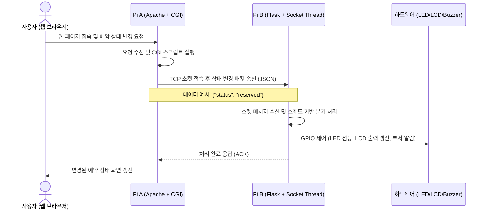
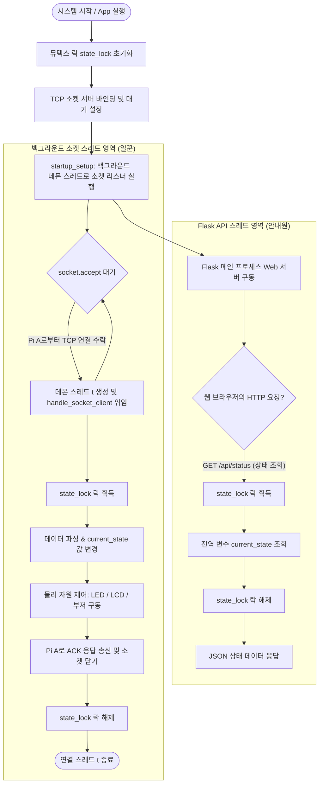

# [프로젝트 제안서] 스마트 예약 시스템 (Smart Reservation System)

본 제안서는 두 대의 라즈베리 파이(Pi A, Pi B)를 활용하여 웹 기반 사용자 제어 인터페이스와 실시간 물리 하드웨어 알림이 유기적으로 결합된 IoT 스마트 예약 시스템 구축에 대한 계획을 담고 있습니다.

---

## 1. 연구 목표 (Research Objectives)

본 연구의 목적은 공간 및 자원의 이용 효율성을 극대화하기 위해 웹 인터페이스와 실시간 물리 디바이스 피드백이 연동되는 **'스마트 예약 시스템'**을 개발하는 것입니다.

*   **실시간 연동형 자원 관리 체계 구축**: 사용자가 웹 브라우저를 통해 실시간으로 예약 현황을 조회 및 변경하고, 물리 공간에 설치된 IoT 장치(LED, LCD, 부저)가 상태 변화를 즉시 시각·청각적으로 표시하는 동기화 시스템 구현.
*   **이기종/이중화 하드웨어 연동 설계**: 웹 서버/CGI 클라이언트(Pi A)와 하드웨어 제어부(Pi B)로 역할을 나누어 시스템 부하를 분산하고 독립성을 확보하는 네트워크 아키텍처 수립.
*   **스레드 안전성(Thread Safety)을 보장하는 제어 시스템 개발**: 다수의 사용자 요청이 동시에 유입되는 환경에서도 상태 왜곡이나 하드웨어 충돌 없이 안전하게 동작하도록 동시성 제어 메커니즘 설계.

---

## 2. 연구 내용 (Research Content)

### 2.1. 전체 시스템 아키텍처 개요
시스템은 사용자 접점인 **Pi A (Web Server & CGI Client)**와 하드웨어 및 상태 처리를 담당하는 **Pi B (Flask & Hardware Control Server)**로 구성됩니다. 두 디바이스는 TCP 소켓 통신을 통해 실시간으로 예약 상태 데이터를 송수신합니다.

---

### 2.2. Pi A 적용 기술 (Web & Gateway Part)
Pi A는 사용자의 요청을 접수하고 이를 가공하여 하드웨어 제어부로 중계하는 게이트웨이 역할을 수행합니다.

*   **웹 프론트엔드 (UI/UX)**
    *   **HTML5 & CSS3**: 사용자에게 현재 공간/자원의 상태(대기, 예약, 사용)를 시각적으로 보여주는 반응형 웹 대시보드 구축.
    *   **JavaScript (Async API Fetch)**: 브라우저 새로고침 없이 상태 변경 요청을 비동기적으로 처리하여 매끄러운 사용자 경험 제공.
*   **웹 서버 및 CGI 게이트웨이**
    *   **Apache Web Server**: 외부 사용자 접속을 안전하고 안정적으로 처리하기 위한 웹 서버 엔진 구성.
    *   **Apache CGI (Common Gateway Interface) 활성화**: Python 기반 백엔드 스크립트가 웹 요청을 처리할 수 있도록 Apache CGI 모듈 설정.
    *   **Python Socket Client (`update_status.py`)**: 웹 인터페이스로부터 입력된 상태 변경 요청을 JSON 데이터 형식으로 인코딩한 후, 지정된 Pi B의 IP 주소와 포트로 TCP Raw Socket 연결을 시도하여 데이터를 전송하는 연동 모듈 구현.

---

### 2.3. Pi B 적용 기술 (Control & Hardware Part)
Pi B는 실시간 요청 수신, 상태 관리, 물리 하드웨어 인터페이스 제어를 담당하는 시스템의 핵심 구동부입니다.

*   **웹 프레임워크**: Flask를 사용한 REST API 설계 및 상태 조회 기능 제공.
*   **통신 인터페이스**: `socket` 모듈을 이용한 저지연 TCP 소켓 서버 탑재.
*   **스레드 관리**: `threading` 패키지를 통한 병렬 소켓 접속 처리 및 백그라운드 상시 수신 대기.
*   **물리 하드웨어 제어**:
    *   **LED**: `RPi.GPIO` 라이브러리로 상태별 삼색 LED(대기: 초록, 예약: 노랑, 사용: 빨강) 제어.
    *   **LCD**: I2C 백팩 모듈 또는 GPIO 직접 연결 방식을 지원하는 `RPLCD` 라이브러리로 상태 문자열 표시.
    *   **부저**: GPIO PWM 주파수 변조를 통한 상태 전이 멜로디(상승/하강 3음계) 출력.
*   **시스템 자동화 및 상시 운영 환경**:
    *   **자동 설정 쉘 스크립트 (`setup.sh`)**: 필수 의존성 패키지 설치 및 LCD 모드 설정을 자동화하여 신속한 배포 지원.
    *   **Systemd Daemon 서비스 등록**: 부팅 시 Flask 및 소켓 서버가 백그라운드에서 자동 시작되고, 에러 발생 시 자동 재기동(`Restart=always`)되도록 환경을 구성하여 상시 대기 상태 확보.

---

### 2.4. Flask, 스레드 및 소켓 운용 메커니즘 (Core Concurrency Architecture)
시스템의 실시간 반응성과 안정성을 확보하기 위해 Flask 웹 서버와 TCP 소켓 서버를 병렬로 구동하고, 동시성 문제를 해결한 아키텍처는 다음과 같이 운용됩니다.

> **💡 쉽게 이해하는 시스템 역할 비유**
> *   **소켓 서버 (명령을 수행하는 "일꾼")**: Pi A(웹 서버 백엔드)로부터 "상태를 '예약'으로 변경하라"는 제어 명령을 직접 수신하여 LED를 켜고, LCD 화면을 쓰고, 부저를 울리는 등의 하드웨어 작업을 신속히 처리한 뒤 "성공적으로 변경 완료!"라고 응답(ACK)하는 내부 일꾼입니다.
> *   **Flask 서버 (현황을 알려주는 "안내원")**: 사용자가 스마트폰이나 PC 웹 브라우저를 통해 "현재 상태가 어떤가요?"라고 조회할 때, 현재 상태값을 조회해서 화면에 띄울 수 있도록 즉시 응답(JSON)해주는 전용 안내원입니다.
> *   **멀티스레드 (동시 처리를 위한 "분신술")**: 수많은 웹 사용자가 동시에 접속하거나 상태 변경 요청이 한꺼번에 밀려올 때, 서버가 멈추지 않도록 자기 복제 분신(Thread)을 동적으로 만들어 요청을 하나씩 나누어 맡아 병렬로 처리합니다.
> *   **뮤텍스 락 (꼬임을 방지하는 "화장실 문고리")**: 일꾼이 예약 상태를 변경하고 하드웨어를 제어하는 찰나의 순간에 안내원이 상태를 조회하면 데이터가 꼬이거나 오작동(경쟁 상태)할 수 있습니다. 이를 방지하기 위해 상태 값을 조회하거나 변경할 때는 오직 한 번에 하나의 스레드만 접근할 수 있도록 안전하게 문을 잠그는(Lock) 규칙을 적용합니다.

#### 1) Flask와 소켓 서버의 병렬 구동 (안내원과 일꾼의 공존)
*   메인 프로세스인 Flask 웹 서비스가 켜지기 직전, 소켓 서버를 별도의 백그라운드 스레드(데몬 스레드)로 분리하여 구동합니다.
*   이로 인해 Flask(사용자 상태 조회용 HTTP 포트)와 TCP 소켓(장비 간 상태 변경 명령용 전용 포트)이 서로의 통신 영역을 침범하지 않고 병목현상 없이 완벽히 동시에 작동합니다.

#### 2) 논블로킹 처리를 위한 일회성 분신 생성 (동적 스레드 분기)
*   소켓 서버에 연결 요청이 들어오면, 본래 대기 중이던 메인 스레드가 멈춰서 일하지 않도록 즉시 일회성 작업 전용 스레드를 생성하여 일을 위임합니다.
*   해당 전용 스레드는 전달받은 명령을 처리하고 응답을 준 뒤 즉시 자동 소멸하여 메모리를 낭비하지 않고 시스템 리소스를 안정적으로 유지합니다.

#### 3) 안전성 유지를 위한 차례 대기 (뮤텍스 락)
*   **경쟁 상태(Race Condition) 방지**: Flask 스레드(상태 읽기)와 소켓 스레드(상태 쓰기/하드웨어 갱신)가 단 하나의 데이터 저장소(`current_state`)에 동시에 접근해 데이터를 덮어쓰거나 엉뚱한 값을 읽어가는 오작동을 차단합니다.
*   **임계 영역 잠금**: 파이썬의 `threading.Lock()`을 활용해 하나의 스레드가 공유 데이터를 만지고 있을 때는 다른 스레드의 접근을 잠시 대기시킵니다. 작업 완료와 동시에 잠금이 풀리므로 데이터와 하드웨어가 항상 일치하며 안정적으로 운영됩니다.

---

## 3. 기대 효과 (Expected Effects)

*   **자원 관리 및 이용 편의성 극대화**: 이용자가 현장에 직접 가보지 않고도 모바일이나 PC 웹 브라우저로 실시간 현황을 신속히 파악하고 예약할 수 있어 대기 및 관리 비용 최소화.
*   **직관적인 사용자 경험 제공 (Multi-modal UI/UX)**: 웹 화면의 가상 인터페이스뿐 아니라 LED, LCD, 부저 소리와 같은 다감각 피드백을 통해 오예약이나 비인가 자원 점유를 방지하고 사용률 최적화.
*   **시스템 안정성 및 확장성 확보**: 멀티스레드와 뮤텍스 락 기반의 견고한 설계를 바탕으로 대량의 동시 예약 요청 시에도 데드락이나 상태 불일치 없이 신뢰성 있는 서비스 제공.
*   **인프라 확장 편의성**: `setup.sh` 스크립트 기반의 자동화 덕분에 새로운 공간이나 장치에 신속하게 시스템을 복제 및 배포 가능하며, 향후 DB 연동 및 중앙 통제 모니터링 시스템으로 쉽게 확장 가능.
