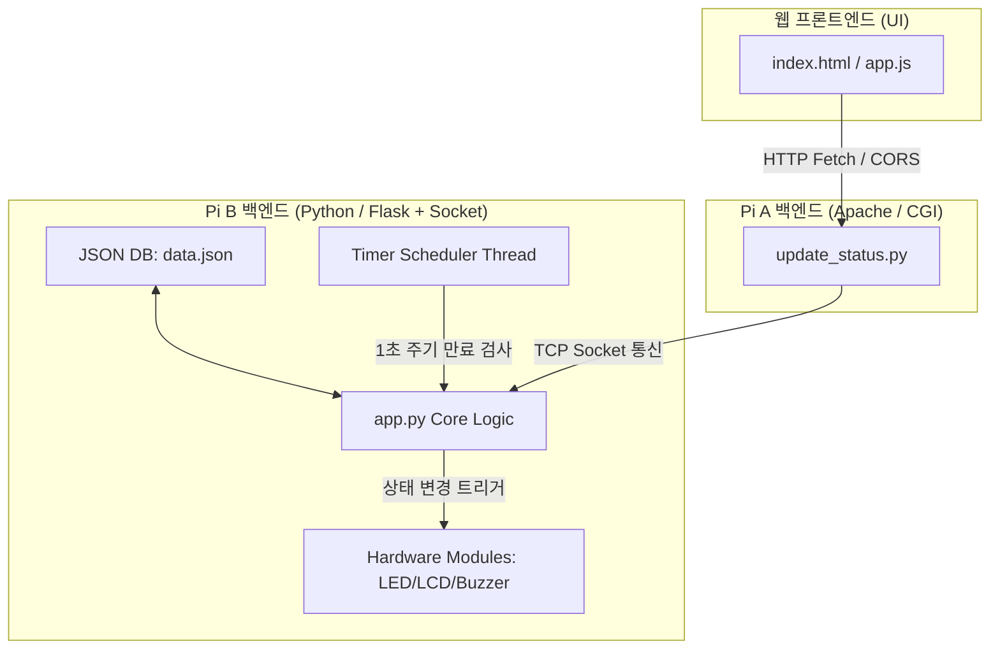

# 스마트 예약 시스템 개선 구현 계획 (다중 자원 & 본인 인증 & 자동 취소)

본 계획서는 단일 자원 제어 시스템을 확장하여 여러 개의 공용 공간 및 물품을 통합 관리하고, PIN 번호 기반의 간편 사용자 인증과 자동 예약 만료(No-show 방지) 및 사용 만료 기능을 추가하기 위한 개선 설계안을 담고 있습니다.

---

## 1. 개요 및 요구사항 정의

### 1.1 개선 목적
- **다중 자원 확장**: 회의실, 학과 PC, 공용 스테이플러 등 다양한 유형의 공간 및 물품을 동시에 독립적으로 관리.
- **간편 사용자 식별 및 보안**: 로그인/회원가입의 복잡한 절차 없이, **예약 시 4자리 PIN 코드**를 설정하여 본인 외의 타인이 사용을 강탈하거나 예약을 취소하는 오용 방지.
- **자동 취소 및 반납 (타이머)**:
  - **예약 유지 시간 만료**: 예약 후 지정된 대기 시간 내에 '사용'으로 전환하지 않으면 노쇼(No-show)로 판단하여 자동으로 '대기' 상태로 전환.
  - **이용 시간 만료**: 사용 시작 후 아이템별 고정된 이용 시간이 지나면 자동으로 '대기' 상태로 반납 처리.

### 1.2 하드웨어 연동 설계
여러 아이템이 존재할 때 1세트의 물리 하드웨어(LED, LCD, 부저)는 다음과 같이 매핑합니다.
- **모니터링 대상 기기 매핑 (Focusing Mode)**: 웹 대시보드에서 사용자가 "현재 물리 기기로 모니터링할 아이템"을 선택(Focus)할 수 있게 합니다.
- **LCD 표시**: LCD 첫째 줄에 현재 포커스된 아이템의 이름(예: `PC 1`, `Stapler`)을 표시하고, 둘째 줄에 해당 아이템의 상태(`Available`, `Reserved`, `In Use`)를 출력합니다.
- **LED/부저**: 현재 포커스된 아이템의 상태 전이에 반응하여 삼색 LED 점등 및 부저 멜로디(상승/하강음)를 출력합니다.

---

## 2. User Review Required

> [!IMPORTANT]
> **1. PIN 번호 분실 시의 조치**
> - 별도의 관리자 로그인 기능 없이 간편 PIN(4자리 숫자)으로 예약자를 식별하므로, 사용자가 PIN을 분실하면 예약/사용 상태를 해제하기 어려울 수 있습니다.
> - **대안안**: 관리자용 마스터 PIN(예: `0000` 또는 `config.py`에 정의된 특정 마스터 코드)을 두어, 마스터 코드를 입력하면 어떤 아이템이든 즉시 '대기' 상태로 강제 반납/취소할 수 있게 기능을 추가하고자 합니다. 이에 대해 검토 부탁드립니다.
>
> **2. 자동 만료 시간 사양**
> - 각 아이템별로 고정된 '이용 시간' 및 '예약 유효 대기 시간'의 예시를 다음과 같이 구성하였습니다. 추가하거나 변경을 원하시는 아이템 사양이 있다면 피드백 부탁드립니다.
>   - **회의실**: 예약 대기 10분 / 이용 시간 60분
>   - **학과 PC**: 예약 대기 15분 / 이용 시간 120분
>   - **공용 스테이플러**: 예약 대기 2분 / 이용 시간 5분
>   - **테스트용 라즈베리파이**: 예약 대기 20분 / 이용 시간 180분

---

## 3. Open Questions

> [!IMPORTANT]
> - **Q1. 데이터 초기화 방식**: 
>   - 서버가 재시작되어도 상태 데이터를 영구히 유지하기 위해 `pi_b_flask/data.json` 파일에 상태를 기록하는 JSON DB 방식을 기본 설계로 채택하였습니다. 혹시 별도의 SQLite 등 정식 RDBMS 도입이 필요하신가요? (간단한 구현을 위해서는 JSON 파일 DB 방식이 가장 경량입니다.)
> - **Q2. 소켓 포트 유지 여부**:
>   - 현재 Pi A(CGI) ➔ Pi B(Socket Server) 간의 TCP 소켓 프로토콜 구조를 그대로 사용하되, 전송하는 JSON 페이로드 구조만 변경할 예정입니다. 이 방식에 동의하시는지 확인 바랍니다.

---

## 4. Proposed Changes



### 4.1. 통신 데이터 프로토콜 확장
상태 제어 및 조회 시 주고받는 JSON 구조가 다음과 같이 세분화됩니다.

#### [CGI ➔ Pi B 소켓 서버 제어 패킷]
```json
{
  "item_id": "meeting_room",
  "state": "reserved",
  "pin": "1234",
  "action": "change_state" // "change_state" 또는 "set_focus"
}
```
* 포커스 아이템 변경 시: `{"action": "set_focus", "item_id": "meeting_room"}`

#### [Pi B ➔ CGI 응답 및 상태 조회 패킷]
```json
{
  "status": "success",
  "active_monitor_item": "meeting_room",
  "items": {
    "meeting_room": {
      "name": "회의실",
      "state": "reserved",
      "has_pin": true, // 보안상 실제 PIN 평문은 클라이언트에 노출하지 않고 여부만 전달
      "status_changed_at": 1718442000.0,
      "usage_duration": 3600,
      "reservation_timeout": 600,
      "remaining_seconds": 540
    },
    "stapler": {
      "name": "공용 스테이플러",
      "state": "idle",
      "has_pin": false,
      "status_changed_at": 1718442500.0,
      "usage_duration": 300,
      "reservation_timeout": 120,
      "remaining_seconds": 0
    }
  }
}
```

---

### 4.2. 주요 컴포넌트별 변경 상세

#### [MODIFY] [config.py](file:///c:/Users/USER/Desktop/2502110649_jinyong/%EC%88%98%EC%97%85/2%ED%95%99%EB%85%84_1%ED%95%99%EA%B8%B0/IoT%EC%A0%9C%EC%96%B4%EC%8B%A4%EC%8A%B5/reservation_projects/light_reservation/pi_b_flask/config.py)
- 아이템들의 고정 이용 시간 및 예약 취소 대기 시간 정의.
- JSON DB 파일 경로 (`data.json`) 설정.
- 관리자 마스터 비밀번호 설정(예: `MASTER_PIN = "0000"`).

#### [MODIFY] [app.py](file:///c:/Users/USER/Desktop/2502110649_jinyong/%EC%88%98%EC%97%85/2%ED%95%99%EB%85%84_1%ED%95%99%EA%B8%B0/IoT%EC%A0%9C%EC%96%B4%EC%8B%A4%EC%8A%B5/reservation_projects/light_reservation/pi_b_flask/app.py)
- **JSON 파일 DB 매니저**: 파일 입출력 로직 및 상태 변경 후 저장 구현.
- **백그라운드 스케줄러 스레드**: `while True:` 루프 안에서 1초마다 모든 아이템을 검사.
  - '예약' 상태이고 `reservation_timeout` 초과 시 ➔ 자동으로 '대기'로 강제 전환 & 하드웨어 반영.
  - '사용' 상태이고 `usage_duration` 초과 시 ➔ 자동으로 '대기'로 강제 반납 & 하드웨어 반영.
- **상태 변경 검증 로직**:
  - `reserved` ➔ `in_use`: 클라이언트가 전송한 `pin`이 저장된 `pin`과 일치하는지 확인.
  - `reserved` 또는 `in_use` ➔ `idle` (취소/반납): 클라이언트의 `pin`이 저장된 `pin` 또는 `MASTER_PIN`과 일치하는지 확인.
  - `idle` ➔ `reserved`: `pin`을 필수로 수신하여 신규 저장.
- **소켓 / API 변경**: 다중 아이템 딕셔너리와 모니터링 대상 ID를 정상 직렬화하여 반환.

#### [MODIFY] [lcd.py](file:///c:/Users/USER/Desktop/2502110649_jinyong/%EC%88%98%EC%97%85/2%ED%95%99%EB%85%84_1%ED%95%99%EA%B8%B0/IoT%EC%A0%9C%EC%96%B4%EC%8B%A4%EC%8A%B5/reservation_projects/light_reservation/pi_b_flask/hardware/lcd.py)
- `display_status(state, item_name)` 메소드 수정.
  - Line 1: `[Item Name]` 좌측 정렬 출력.
  - Line 2: `Status: [State]` (Available / Reserved / In Use) 출력.

#### [MODIFY] [led.py](file:///c:/Users/USER/Desktop/2502110649_jinyong/%EC%88%98%EC%97%85/2%ED%95%99%EB%85%84_1%ED%95%99%EA%B8%B0/IoT%EC%A0%9C%EC%96%B4%EC%8B%A4%EC%8A%B5/reservation_projects/light_reservation/pi_b_flask/hardware/led.py) & [buzzer.py](file:///c:/Users/USER/Desktop/2502110649_jinyong/%EC%88%98%EC%97%85/2%ED%95%99%EB%85%84_1%ED%95%99%EA%B8%B0/IoT%EC%A0%9C%EC%96%B4%EC%8B%A4%EC%8A%B5/reservation_projects/light_reservation/pi_b_flask/hardware/buzzer.py)
- 모니터링 중인 기기(`active_monitor_item`)에 대한 상태 변화만 물리 장치(LED 켜기, 부저 재생)에 통보하고 처리하도록 갱신.

#### [MODIFY] [update_status.py](file:///c:/Users/USER/Desktop/2502110649_jinyong/%EC%88%98%EC%97%85/2%ED%95%99%EB%85%84_1%ED%95%99%EA%B8%B0/IoT%EC%A0%9C%EC%96%B4%EC%8B%A4%EC%8A%B5/reservation_projects/light_reservation/pi_a_apache/api/update_status.py)
- 클라이언트로부터 전달받은 JSON 파라미터(`item_id`, `state`, `pin`, `action`)들을 디코딩하여 Pi B 소켓 서버로 고스란히 포워딩.

#### [MODIFY] [index.html](file:///c:/Users/USER/Desktop/2502110649_jinyong/%EC%88%98%EC%97%85/2%ED%95%99%EB%85%84_1%ED%95%99%EA%B8%B0/IoT%EC%A0%9C%EC%96%B4%EC%8B%A4%EC%8A%B5/reservation_projects/light_reservation/pi_a_apache/index.html)
- **아이템 목록 영역**: 등록된 자원 목록을 그리드 카드로 렌더링. 각 자원의 이름, 현재 상태, 타이머(남은 시간), "모니터링 지정" 버튼 표시.
- **PIN 입력 모달**: 예약을 걸거나 예약을 사용/반납할 때 4자리 PIN을 간편하게 입력할 수 있는 슬릭한 글래스모피즘 팝업 레이아웃 추가.

#### [MODIFY] [app.js](file:///c:/Users/USER/Desktop/2502110649_jinyong/%EC%88%98%EC%97%85/2%ED%95%99%EB%85%84_1%ED%95%99%EA%B8%B0/IoT%EC%A0%9C%EC%96%B4%EC%8B%A4%EC%8A%B5/reservation_projects/light_reservation/pi_a_apache/app.js)
- 5초 주기 폴링 외에도, 화면에 각 아이템 카드의 카운트다운 타이머(초 단위 감소)를 매끄럽게 그리는 1초 주기 타이머 루프 탑재.
- API 호출 시 `item_id`와 사용자가 입력한 `pin`을 포함하여 전송하는 로직 작성.

---

## 5. 검증 계획 (Verification Plan)

### 자동화 테스트 (Automated Tests)
- `tests/test_integration.py`를 확장하여, 다중 아이템 상태를 더미 데이터에 쓰고 만료 시점을 모조 조작(Mocking)한 뒤 백그라운드 스케줄러가 정상적으로 `idle`로 상태를 자동 전환시키는지 검증.
- 유효한 PIN과 유효하지 않은 PIN을 전송해 각각의 성공 및 거절 응답 코드를 검증하는 유닛 테스트 실행.

### 수동 검증 (Manual Verification)
1. **웹 UI 다중 기기 예약 제어**:
   - 웹 화면에서 '회의실'을 선택하고 PIN `1234`로 예약 ➔ 화면에 노란색 불이 켜지며 만료 시간 카운트다운이 시작되는지 확인.
   - 다른 브라우저 창을 켜서 해당 예약을 PIN 없이 '사용'으로 변경하려 할 때 차단되는지 확인.
   - 올바른 PIN `1234`를 입력하여 '사용'으로 변경 시, 상태가 변경되고 새로운 사용 만료 시간 카운트다운이 돌아가는지 확인.
2. **자동 취소 검증**:
   - '공용 스테이플러'를 예약(대기 시간 2분)하고 아무런 입력 없이 대기 ➔ 2분이 지난 후 자동으로 '대기' 상태로 전환되는지 확인.
3. **물리 하드웨어 연동 테스트**:
   - 웹 UI에서 모니터링 대상을 '학과 PC'로 전환 ➔ LCD에 `PC` 이름과 상태가 올바르게 연동되어 출력되고, 상태 전이 시 LED와 부저 멜로디가 모니터링 대상에 한해 정확히 울리는지 청각/시각 검증.
