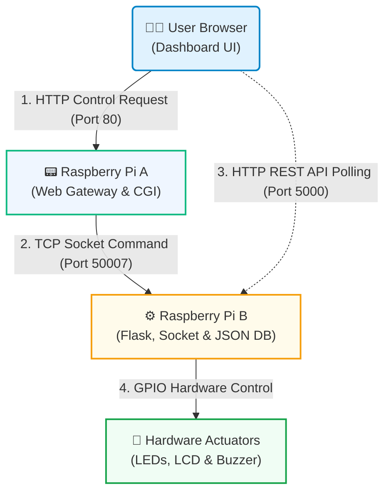
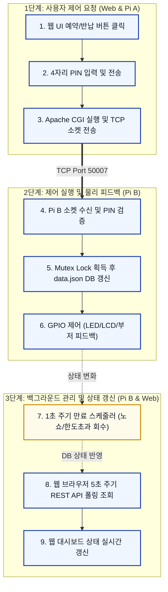

# 스마트 통합 자원 예약 시스템 다이어그램 명세 (Diagram Specs)

이 문서는 시스템 구성도와 시스템 연동 흐름도를 마크다운 내 Mermaid 코드 형태로 제공합니다. 
VS Code, GitHub 등 마크다운 내 Mermaid 렌더링이 가능한 환경에서 이 문서를 열어 렌더링된 다이어그램을 캡처한 후, **`images` 폴더** 아래에 다음 파일명으로 저장해주세요.

1. **전체 시스템 구성도 (UML Component Diagram)**
   - 캡처 파일명: `system_architecture.png`
   - 저장 경로: `images/system_architecture.png`
2. **전체 시스템 연동 흐름도 (Flow Chart)**
   - 캡처 파일명: `system_flowchart.png`
   - 저장 경로: `images/system_flowchart.png`

---

## 1. 전체 시스템 구성도 (UML Component Diagram)

---

## 2. 전체 시스템 연동 흐름도 (Flow Chart)

