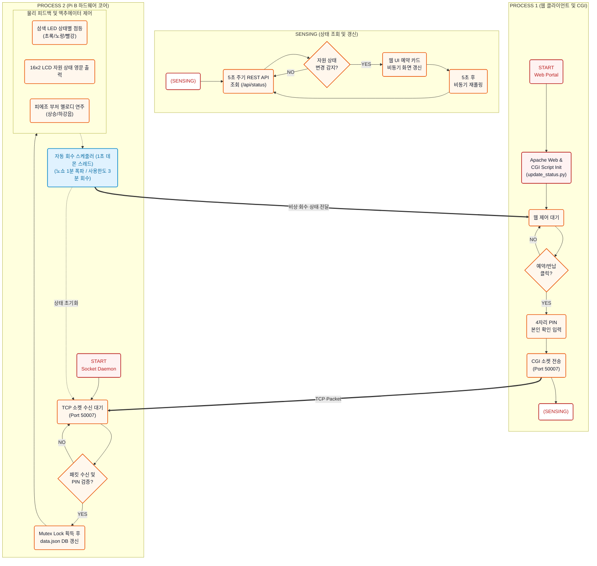

# 스마트 통합 자원 예약 시스템 다이어그램 명세 (Diagram Specs)

이 문서는 시스템 구성도와 시스템 연동 흐름도를 마크다운 내 Mermaid 코드 형태로 제공합니다. 
VS Code, GitHub 등 마크다운 내 Mermaid 렌더링이 가능한 환경에서 이 문서를 열어 렌더링된 다이어그램을 캡처한 후, **`images` 폴더** 아래에 다음 파일명으로 저장해주세요.

1. **전체 시스템 구성도 (UML Component Diagram)**
   - 캡처 파일명: `system_architecture.png`
   - 저장 경로: `images/system_architecture.png`
2. **전체 시스템 연동 흐름도 (Flow Chart)**
   - 캡처 파일명: `system_flowchart.png`
   - 저장 경로: `images/system_flowchart.png`

---

## 1. 전체 시스템 구성도 (UML Component Diagram)

```mermaid
graph TD
    classDef user fill:#e0f2fe,stroke:#0284c7,stroke-width:2px;
    classDef pia fill:#eff6ff,stroke:#10b981,stroke-width:2px;
    classDef pib fill:#fffbeb,stroke:#f59e0b,stroke-width:2px;
    classDef hw fill:#f0fdf4,stroke:#16a34a,stroke-width:2px;

    User("🧑‍💻 User Browser<br>(Dashboard)"):::user
    
    subgraph PiA ["📟 Raspberry Pi A (Gateway)"]
        Apache["Apache Web Server<br>(Port 80)"]:::pia
        CGI["CGI Script<br>(update_status.py)"]:::pia
    end
    
    subgraph PiB ["⚙️ Raspberry Pi B (Hardware Core)"]
        Flask["Flask Server<br>(Port 5000)"]:::pib
        Socket["Socket Listener Thread<br>(Port 50007)"]:::pib
        Mutex["Mutex Lock & data.json"]:::pib
        Scheduler["Background Scheduler Thread<br>(1s loop daemon)"]:::pib
    end
    
    subgraph HW ["🚨 Hardware Actuators"]
        LED["LEDs (3-color)"]:::hw
        LCD["16x2 Character LCD"]:::hw
        Buzzer["Piezo Buzzer"]:::hw
    end
    
    User -->|HTTP Request / static files| Apache
    Apache -->|Execute| CGI
    CGI -->|TCP Socket Command (Port 50007)| Socket
    User -.->|HTTP REST API Polling (Port 5000)| Flask
    Socket -->|Write State (Mutex)| Mutex
    Flask -->|Read State (Mutex)| Mutex
    Scheduler -->|Read/Write State (Mutex)| Mutex
    
    Socket -->|GPIO Control| HW
    Scheduler -->|Auto Expiration / GPIO Control| HW
```

---

## 2. 전체 시스템 연동 흐름도 (Flow Chart)


